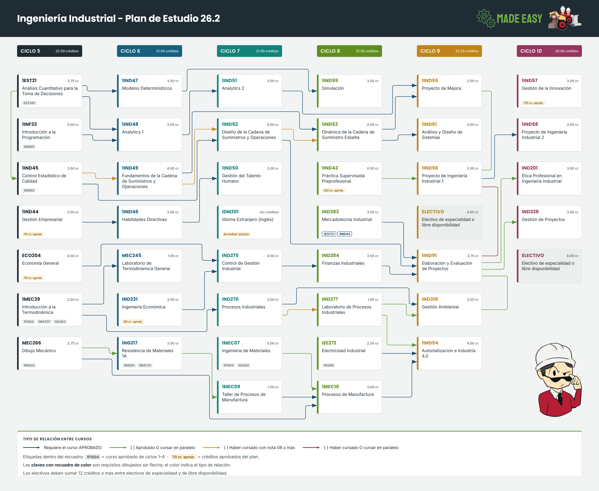

# Ingeniería Industrial · Plan de Estudio 26.2

Malla interactiva de requisitos entre cursos de Ingeniería Industrial (PUCP), ciclos 5 al 10,
según el plan de estudios vigente en el semestre **2026-2**.

**Ver la malla:** https://USUARIO.github.io/REPOSITORIO/
*(reemplaza `USUARIO` y `REPOSITORIO` una vez publicada — ver más abajo)*



---

## Qué contiene

| Archivo | Qué es |
|---|---|
| `index.html` | La malla interactiva. **Un solo archivo**: fuentes, logos e imágenes van incrustados, así que funciona sin conexión y sin dependencias. |
| `malla-plan-estudio-26-2.png` | La misma malla como imagen de 6736 × 5524 px, apta para imprimir en A1 o A0. |
| `generador/` | El código que produce ambos archivos, por si el plan cambia. |

## Cómo se usa

- **Pasa el cursor sobre un curso** y el diagrama aísla sus dependencias: se resaltan los cursos que lo habilitan y los que dependen de él.
- **Ajustar / 100 % / + / −** controlan el zoom. Por defecto la malla encaja al ancho de la ventana.
- **Arrastra** con el mouse para desplazarte cuando estés con zoom.
- Las **casillas de la barra** ocultan o muestran cada tipo de relación.

## Cómo leer el diagrama

Cada flecha nace en el curso-requisito y apunta al curso que lo exige. El color indica el tipo de relación, siguiendo la notación del plan de estudios:

| Color | Notación en el PDF | Significado |
|---|---|---|
| Azul | *(sin símbolo)* | Requiere el curso **aprobado** |
| Verde | `[ ]` | Aprobado **o** cursar en paralelo |
| Ámbar | `( )` | Haber cursado con nota 08 o más |
| Rojo | `{ }` | Haber cursado **o** cursar en paralelo |

Los requisitos que no son cursos de estos ciclos aparecen como etiqueta dentro del recuadro:
`1FIS04` es un curso aprobado de los ciclos 1 al 4, y `70 cr. aprob.` son créditos acumulados del plan.
Las claves con recuadro de color son requisitos dibujados sin flecha.

---

## Publicar en GitHub Pages

1. Crea un repositorio **público** en GitHub y sube estos archivos (arrastrarlos a la web de GitHub basta).
2. Entra a **Settings → Pages**.
3. En *Source* elige **Deploy from a branch**, rama `main` y carpeta `/ (root)`. Guarda.
4. Espera un minuto. La URL aparece en esa misma página, con la forma
   `https://USUARIO.github.io/REPOSITORIO/`.

Cualquiera puede abrir ese enlace desde el navegador, sin cuenta de GitHub y sin instalar nada.
Cada vez que subas un `index.html` nuevo, el sitio se actualiza solo en un par de minutos.

> El repositorio debe ser público para que Pages funcione con una cuenta gratuita.
> Si lo necesitas privado, GitHub pide un plan de pago.

Después de publicar, actualiza el enlace del inicio de este README y la etiqueta
`og:image` de `index.html` con la URL completa del PNG, para que las vistas previas
al compartir el enlace muestren la malla.

---

## Regenerar la malla

Solo necesitas Python 3 (sin librerías externas) y un Chromium para exportar el PNG.

```bash
cd generador
python3 malla.py          # escribe print_A.html (para exportar) y Malla_A_flechas.html (interactiva)
python3 check.py          # verifica cruces de flechas y colisiones con los recuadros
```

Para cambiar el plan, edita la lista `COURSES` al inicio de `malla.py`. Cada curso es
`(ciclo, clave, nombre, créditos, [requisitos])` y los requisitos se escriben tal como
aparecen en el PDF, con sus corchetes o paréntesis. El resto se recalcula solo.

### Cómo se acomoda el diagrama

El orden vertical de los cursos no está escrito a mano: se calcula. El grafo se modela por capas
—una por ciclo— y las flechas que saltan más de un ciclo se parten en nodos ficticios, al estilo
Sugiyama. Sobre eso corren 80 barridos de baricentro y un refinamiento por transposición de pares,
lo que baja los cruces de 77 a 0.

El ruteo es ortogonal. Las flechas largas viajan por los pasillos horizontales entre recuadros,
y dentro de cada canal vertical los carriles se ordenan con una búsqueda local (intercambios,
reinserciones y 120 reinicios aleatorios) que minimiza los cruces restantes.
`check.py` reconstruye los trazados del SVG y comprueba intersección segmento a segmento:
el resultado debe ser **0 cruces y 0 colisiones**.

---

Diseño y colores: **Made Easy**.
